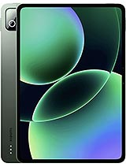

# Xiaomi Pad 8 Pro (piano)



Unofficial TWRP 16 device tree for Xiaomi Pad 8 Pro (piano, SM8750).

## Status

**Working**
- Decryption (PIN)
- ADB
- Touch
- Mount / unmount
- Backup
- OTA install
- Slot switch
- Battery percentage
- USB detection

**Not working**
- Charging in recovery

## Repository layout

```
├── BoardConfig.mk       # board config
├── device.mk            # product config
├── recovery.fstab       # partitions
├── recovery/root/       # recovery ramdisk
├── prebuilt/            # stock secure-stack binaries
├── sepolicy/            # SELinux policy
├── patches/             # source patches
├── tools/               # build helper scripts
└── docs/                # notes
```
